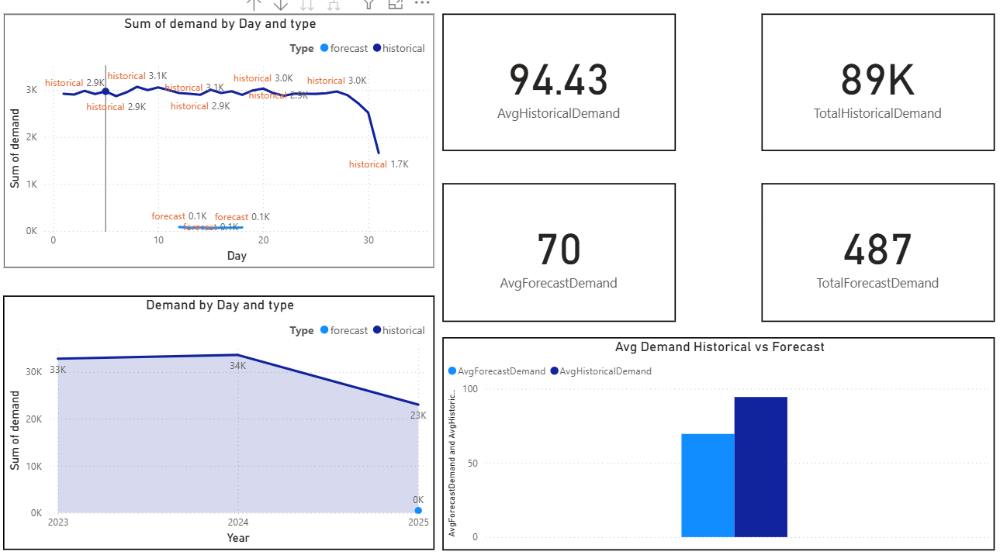
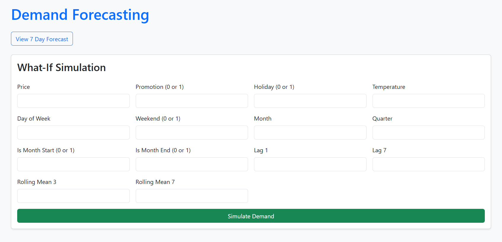
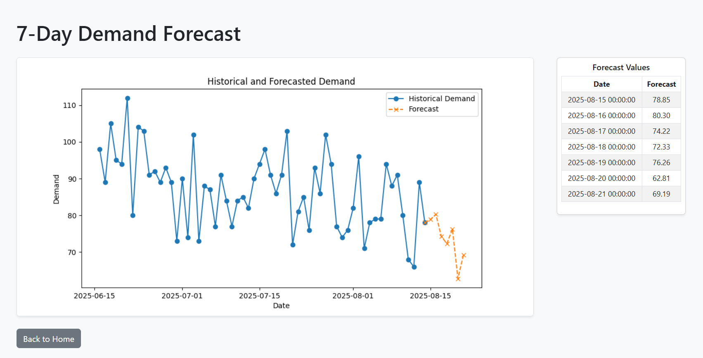
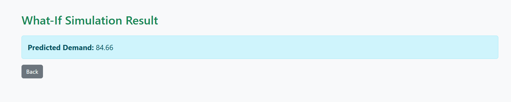

# 📈 Demand Forecasting with Flask API & Power BI

## 🔹 Project Overview
This project predicts **future demand** for a single product using **3.5 years of historical sales data**.  
The forecasting is performed using **SARIMAX** (statistical approach) and **XGBoost** (machine learning approach).

The project includes:
- A **Flask API** deployed on Render for real-time forecasting  
- An **interactive Power BI dashboard** for visualization and insights  
- Simulation capabilities to test hypothetical demand scenarios  

---

## 🔹 Features
- ⏳ **Time Series Forecasting** using SARIMAX & XGBoost  
- 🌐 **Flask API Deployment** (hosted on Render)  
- 📊 **Interactive Power BI Dashboard**  
- ✅ **Model Evaluation** with RMSE & MAE  
- 🎯 **7-Day Rolling Forecast**  
- 🧪 **Simulation Mode** for “what-if” scenarios  
- 📂 **Daily Forecast Updates** possible via API  

---

## 🔹 Dataset
- **Source**: Synthetic dataset generated for demo purposes  
- **Duration**: 3.5 years of daily sales  

---

## 🔹 Project Workflow
1. **Data Preprocessing** – Cleaning, formatting dates, handling missing values  
2. **Feature Engineering** – Adding time-based features, lags, and rolling means  
3. **Model Training** – SARIMAX for trend/seasonality & XGBoost for patterns in features  
4. **Model Evaluation** – RMSE and MAE calculated for both models  
5. **Forecasting** – Generating 7-day forecast results  
6. **API Development** – Building `/forecast` endpoint in Flask  
7. **Deployment** – Hosting Flask API on Render  
8. **Visualization** – Connecting API results to Power BI dashboard  

---

## 🔹 Flask API 
**Live API URL**  
🔗 https://demandforecasting-flask-1.onrender.com/

---

## 🔹 Screenshots

| Feature                    | Screenshot |
|-----------------------------|------------|
| **Power BI Dashboard**     |  |
| **Flask API UI**           |  |
| **7-Day Forecast**         |  |
| **Single Record Simulation** |  |

---

## 🔹 Forecast Accuracy
- **SARIMAX**: RMSE = 20.09, MAE = 17.22  
- **XGBoost**: RMSE = 7.78, MAE = 6.1  

---

## 🔹 API Endpoint
```
/forecast
```

**Example Local URL:**  
```
http://127.0.0.1:5000/forecast
```

---

## 🔹 Technologies Used
- Python (Pandas, NumPy, Scikit-learn, Statsmodels, XGBoost)  
- Flask (for API deployment)  
- Power BI (for visualization)  
- Render (for hosting)  
- Matplotlib / Seaborn (for plots)  

---

## 📂 Project Structure
```
│── app.py                  # Flask API script
│── requirements.txt        # Python dependencies
│── predictions.ipynb       # Model training notebook
│── runtime.txt             # Python version (rename from runtime.txt.txt)
│── xgb_model.pkl           # Trained XGBoost model
│── DemandForecasting.pbix  # Power BI dashboard
│
│── templates/
│    ├── index.html         # API UI template
│    ├── forecast.html      # 7-day forecast
│    └── simulate.html      # Predicted value for single entry
│
│── screenshots/
│    ├── powerbi_dashboard.PNG
│    ├── flask_API_UI.PNG
│    ├── forecast.PNG
│    └── Simulation_Singlerecord.PNG
│
└── README.md
```

---

## 🔹 How to Run Locally
```bash
# 1. Clone repo
git clone https://github.com/Sandhya385/DemandForecasting_Flask.git
cd DemandForecasting_Flask

# 2. Install dependencies
pip install -r requirements.txt

# 3. Run Flask API
python app.py

# 4. Access API
http://127.0.0.1:5000/forecast
```
