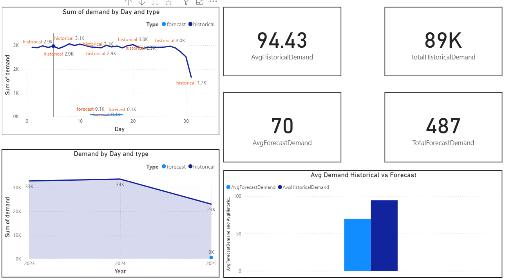

# 📈 Demand Forecasting with Flask API & Power BI

## 🔹 Project Overview
This project predicts future demand for a single product based on 3.5 years of historical sales data.  
The forecasting is performed using **SARIMAX** and **XGBoost**, deployed as a Flask API, and visualized in Power BI.

---

## 🔹 Features
- **Time Series Forecasting** using SARIMAX & XGBoost
- **Flask API Deployment** on Render
- **Interactive Power BI Dashboard**
- Forecast accuracy evaluation using RMSE & MAE

---

## 🔹 Project Workflow
1. **Data Preprocessing** – Cleaned & prepared 3.5 years of historical data.
2. **Model Training** – Built SARIMAX & XGBoost models.
3. **Forecasting** – Predicted demand for the next 7 days.
4. **Deployment** – Hosted Flask API on Render.
5. **Visualization** – Created Power BI dashboard for results.

---

## 🔹 Power BI Dashboard

---

## 🔹 API Endpoint
The forecasting API is hosted on Render:  
`https://<your-render-url>.onrender.com/forecast`

